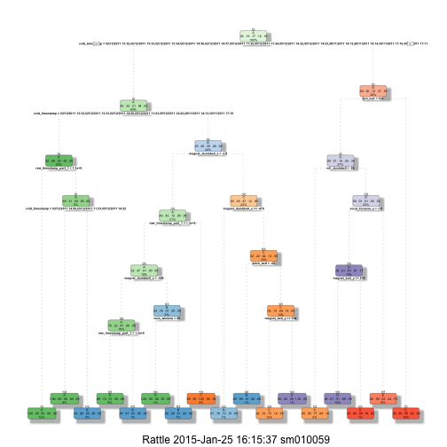

# Practical Machine Learning Course Project
By: Sam Marten, January 25, 2015

### Background

Using devices such as Jawbone Up, Nike FuelBand, and Fitbit it is now possible to collect a large amount of data about personal activity relatively inexpensively. These type of devices are part of the quantified self movement – a group of enthusiasts who take measurements about themselves regularly to improve their health, to find patterns in their behavior, or because they are tech geeks. One thing that people regularly do is quantify how much of a particular activity they do, but they rarely quantify how well they do it. In this project, your goal will be to use data from accelerometers on the belt, forearm, arm, and dumbell of 6 participants. They were asked to perform barbell lifts correctly and incorrectly in 5 different ways. 

More information is available from the website here: http://groupware.les.inf.puc-rio.br/har (see the section on the Weight Lifting Exercise Dataset). 

### Project Goal

The goal of the project is to predict the manner in which these participants did the exercise. This is the "classe" variable in the training set. Any of the other variables may be used to predict with. A report should be created describing how the model was built, how cross validation was used, and an expectation of the out-of-sample error.

### Load Libraries and Get Data

The first step is to do some administrative work: load the libraries we'll need as well as the data from which we'll be learning. We'll also set the random generator seed here as well.


```r
library(caret)
library(randomForest)
library(rattle)
library(rpart)

set.seed(1)

if (!file.exists("./data/pml-training.csv")) {
    trainingUrl <- "https://d396qusza40orc.cloudfront.net/predmachlearn/pml-training.csv"
    download.file(trainingUrl, destfile="./data/pml-training.csv", method="curl")
}

if (!file.exists("./data/pml-test.csv")) {
    testingUrl <- "https://d396qusza40orc.cloudfront.net/predmachlearn/pml-testing.csv"
    download.file(testingUrl, destfile="./data/pml-testing.csv", method="curl")
}

training <- read.csv("./data/pml-training.csv", header=TRUE, na.strings=c("NA","#DIV/0!",""))
test <- read.csv("./data/pml-testing.csv", header=TRUE, na.strings=c("NA","#DIV/0!",""))
```

### Clean and Preprocess Data

To help training effectiveness, let's remove any extraneous or unnecessary columns.


```r
# remove first column, contains only row ids
training <- training[,-1]

# remove any columns that contain entirely NAs
training <- training[, colSums(is.na(training)) == 0]

# check for columns with near zero variance
trainingNZV <- nearZeroVar(training, saveMetrics=TRUE)
colnames(training[trainingNZV$nzv == TRUE])
```

```
## [1] "new_window"
```

The "new window" column has a near zero variance. That will be removed by keeping only the columns that do not have near zero variances.


```r
training <- training[trainingNZV$nzv == FALSE]
```

This leaves us with 58 features to consider.

We'll break the training set into two parts. 60% of the data will be used for training the model. The remaining 40% will be used for cross validation.


```r
inTrain <- createDataPartition(y=training$classe, p=0.6, list=FALSE)
myTraining <- training[inTrain,]
myTesting <- training[-inTrain,]
```

### Recursive Partitioning and Regression Trees

We'll start with a Recursive Partioning and Regression Trees (rpart) model.


```r
# use method="class" since classe is a factor
rpartModFit <- rpart(classe ~ ., data=myTraining, method="class")
fancyRpartPlot(rpartModFit)
```

 

```r
rpartPredictions <- predict(rpartModFit, myTesting, type="class")
rpartResults <- confusionMatrix(rpartPredictions, myTesting$classe)
```

The **Out-of-Sample Accuracy using rpart is 87.14%**. **Out-of-Sample Error using rpart is 12.86%**.  This could be worse but let's see if it can be improved by using another approach.

### Random Forest

We'll now use Random Forest to generate a model and compare the results to the previous model.


```r
rfModFit <- randomForest(classe ~ ., data=myTraining)
rfPredictions <- predict(rfModFit, myTesting, type="class")
rfResults <- confusionMatrix(rfPredictions, myTesting$classe)
```

Much better! **Random Forest gives us 99.89% Out-of-Sample Accuracy (0.11% Out-of-Sample Error**) across the cross validation testing set.

### Results

Given the two models we tested, rpart and Random Forest, **Random Forest performed better with 87.14% Out-of-Sample prediction accuracy**.
